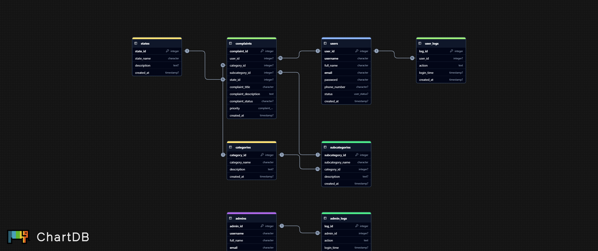

# 🛠️ Complaint Management System Documentation

## 📌 Introduction

The **Complaint Management System** is a robust, scalable platform designed to facilitate the streamlined lodging, management, and resolution of user complaints. Built using modern technologies like **NestJS**, **Node.js**, **TypeScript**, and **PostgreSQL**, the system offers distinct modules for **Admins** and **Users**, along with a clear and maintainable architecture.

This system empowers:

* 👥 **Users** to lodge complaints and track resolutions
* 🧑‍💼 **Admins** to manage categories, user feedback, and complaints effectively

This documentation outlines the stack, core functionalities, relationships, and suggestions for future improvements.

---

## 🧱 Tech Stack

| Tech               | Description                                 |
| ------------------ | ------------------------------------------- |
| 🧪 **NestJS**      | Backend framework for scalable architecture |
| ⚙️ **NodeJS**      | Server runtime environment                  |
| ✨ **TypeScript**   | Typed superset of JavaScript                |
| 🗄️ **PostgreSQL** | Relational database management system       |

---

## 🚀 Features Overview

### 👨‍💼 Admin Module

* 🗂 **Category Management**: Create, edit, delete complaint categories
* 🗂 **Subcategory Management**: Create, edit, delete complaint subcategories
* 🗺 **State Management**: Manage states associated with complaints
* 📋 **Complaint Management**: View complaints, update remarks, and manage status (Open/Closed)
* 👤 **User Management**: View, edit, and delete user records
* 📜 **User Logs**: Monitor user login/logout history and activities
* 📜 **Admin Logs**: View admin login/logout records
* 🔐 **Change Password**: Admins can update their passwords

---

### 🙋 User (Patient/Customer) Module

* 📝 **Registration**: Users can create accounts
* 🔐 **Forgot Password**: Password recovery via email (planned)
* 📢 **Lodge Complaint**: Submit complaints with category, subcategory, and state
* 📂 **Complaint History**: View submitted complaints and statuses
* ⚙️ **Profile Management**: Update profile details and change password
* 🔒 **Change Password**: Secure password update for users

---

## 💡 Suggested Enhancements

These are upcoming or recommended features to make the system more powerful and user-friendly:

* 📩 **SMS & Email Notifications**: Inform users of complaint updates, resolutions, or actions needed
* ⏫ **Complaint Escalation**: Allow users to escalate complaints after a timeout
* 💬 **Feedback Mechanism**: Users can rate or provide feedback on complaint handling
* 🚦 **Priority Levels**: Assign Low, Medium, High priorities to complaints
* 📊 **Admin Analytics Dashboard**: Visual insights and reports for complaints based on categories, departments, or resolution status

---

## 🧩 Entity Relationships

### 📘 Overview

The system comprises key entities with clearly defined relationships, forming the backbone of its data model.

#### 🔐 Admins

* **PK**: `admin_id`
* Relationships:

  * 1 ➝ \* AdminLogs

#### 👥 Users

* **PK**: `user_id`
* Relationships:

  * 1 ➝ \* Complaints
  * 1 ➝ \* UserLogs

#### 🧾 Complaints

* **PK**: `complaint_id`
* Relationships:

  * * ➝ 1 User
  * * ➝ 1 Category
  * * ➝ 1 Subcategory
  * * ➝ 1 State

#### 🗃 Categories

* **PK**: `category_id`
* Relationships:

  * 1 ➝ \* Subcategories
  * 1 ➝ \* Complaints

#### 📂 Subcategories

* **PK**: `subcategory_id`
* Relationships:

  * * ➝ 1 Category
  * 1 ➝ \* Complaints

#### 🗺 States

* **PK**: `state_id`
* Relationships:

  * 1 ➝ \* Complaints

#### 🧾 User Logs

* **PK**: `log_id`
* Relationships:

  * * ➝ 1 User

#### 🧾 Admin Logs

* **PK**: `log_id`
* Relationships:

  * * ➝ 1 Admin

---

### 🔁 Entity Relationship Summary

| 🧩 Entity   | 🔗 Related Entity | 🔢 Cardinality |
| ----------- | ----------------- | -------------- |
| Admin       | Admin Logs        | 1 to Many      |
| User        | Complaints        | 1 to Many      |
| User        | User Logs         | 1 to Many      |
| Complaint   | Category          | Many to 1      |
| Complaint   | Subcategory       | Many to 1      |
| Complaint   | State             | Many to 1      |
| Category    | Subcategories     | 1 to Many      |
| Category    | Complaints        | 1 to Many      |
| Subcategory | Category          | Many to 1      |
| Subcategory | Complaints        | 1 to Many      |
| State       | Complaints        | 1 to Many      |

---

## 🛡️ System Readiness

### ✅ Implemented

* 🔐 Authentication (Sign In, Sign Out)
* ⚠️ Error Handling
* 🔗 Entity Relationships
* 🌱 Database Seeding
* 🗄️ Database Integration (PostgreSQL)
* 🧰 Services Layer & Business Logic
* ✨ Caching using Redis

### ✅ Quick Preview

[http://localhost:8000/api/reference](http://localhost:8000/api/reference)
  
---
